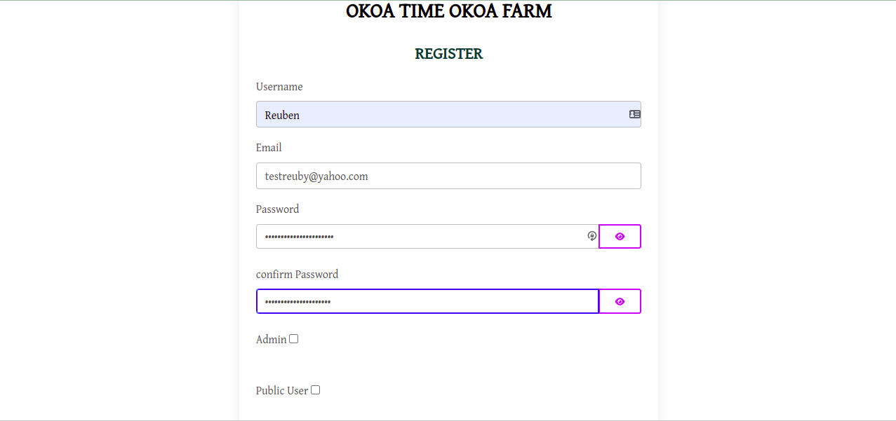
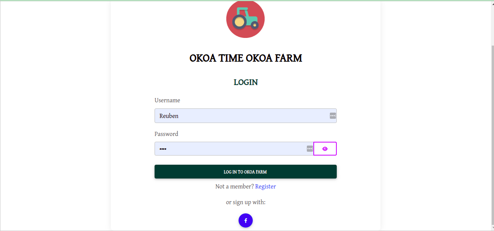
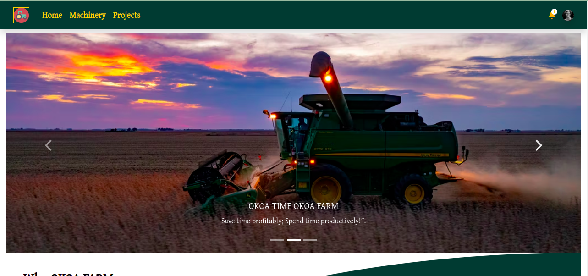

# OKOA FARM

#### By Reuben Kipkemboi

## Table of Content

+ [Description](#description)
+ [Installation Requirement](#installation-requirements)
+ [Technology Used](#technologies-used)
+ [License](#license)
+ [Authors Info](#authors-info)

## Description
Buying farming machinery is expensive and so most farmers afford to hire.The Hiring process is always hectic and time wasting thus making farming activities late.On the other hand machinery operators can’t be trusted because they make false promises.
[Go Back to the top](#okoa-farm)


## User Stories

User Can :-

* Sign in with the application to start using.Sign in ca be as an owner or a general public users.Owners have different roles as compared to general public users.
* Set up a profile biography.
* Find a list of different machinery available.
* Make a simple booking by filling a machinery hire form.
* Machinery owners being able to add machinery, machinery details and determine whether it is available or not.
* As an owner, I can delete or remove m machinery by a button click.
* As an owner I can update the details of my machinery and even make the machinery availability status to a NO.
* As a general user , I can make comments/ feedback and on top of that leave a rating.
* As a user i can be ale to see what other users have said before about OKOA FARM and their services.
* As a user I can be able to see details of a single machinery the price rate of each service offered and make a simple booking.

[Go Back to the top](#okoa-farm)

Registration



Login




Home Module




Create a okoa-farm


Create New Business in your okoa-farm


## Behaviour Driven Development
| Behaviour | Input | Output |
| ---------------- | --------------- | ------------------ |
| Application starts | **On page load** | Login page for user to login |
| Registration| **Registration page** | The registration page has a register form for new users  to register to the application and are redirected to login.Depending on the user type after login users are directed to different views including the  |
| View Details | **View Details click** | `Views Details`button upon clicking this button an can be able to view more details about the machinery and even find an option to update or remove the machinery, and also see the orders that have been made  |
| View Description | **View Description button** | Upon click of `View description button` the user can be able to see the more details about the machinery or she wants to hire, e.g the pay-rate, a small description|
| Profile Icon | **Profile Icon click** | User gets option to view profile, update profile and logout.On view profile user can view and also edit his or her own profile.The logout button ends the users session|
| Forms | **Form filling** | User gets to fill in various forms, and depending on various tasks the form are meant for, upon submission the act is done e.g hiring form which is meant for user to fill in the details and submit the order.|


## Installation Requirements

### Prerequisites

- Django
- Pip & Python
- cloudinary 
- Postgres Database
- Gunicorn

## Instructions
   
##### Clone Repository:  
 ```bash 
https://github.com/Reuben-Kipkemboi/Agric.git 
```
##### Install and activate Virtual Environment virtual  
 ```bash 
cd <projectname> && python3 -m venv virtual && source virtual/bin/activate 
```  
##### Install Dependencies  
 ```bash 
 pip install -r requirements.txt 
```  
##### Setup Database  
  SetUp Database User,Password, Host then following Command  

 ```bash 
python manage.py makemigrations  
 ``` 
 Now Migrate

 ```bash 
 python manage.py migrate 
```
##### Run Application  
 ```bash 
 python3 manage.py runserver 

 or
 ./manage.py runserver
```
##### Test Application  
 ```bash 
 python manage.py test <appname>
```
Open the application on your browser `127.0.0.1:8000`.  

[Go Back to the top](#okoa-farm)


## Technologies Used


## License
[](https://opensource.org/licenses/MIT)

[MIT License](LICENSE)

## Live Site

#### https://okoafarm.herokuapp.com/

## Project slides 

#### https://docs.google.com/presentation/d/1rx0ux85QYff3bnfwzWyhXZzlJQUWaYHljofM-0i1haE/edit#slide=id.ged39eb166d_0_208

## Author's Info

 :email: [Reuben Kipkemboi](https://gmail.com)  

<p align = "center">
    &copy; 2022 @Reuben Kipkemboi.
</p>